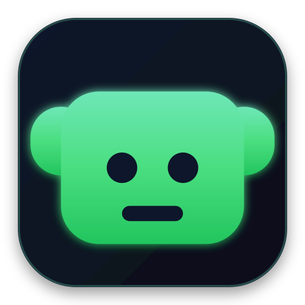

<p align="center">
  
</p>

<h1 align="center">Mischief</h1>

<p align="center">
  The open-source platform for desktop entertainment. 🎭
</p>

<p align="center">
  <a href="#"></a>
  <a href="#"></a>
  <a href="#"></a>
  <a href="#"></a>
  <a href="#"></a>
  <br/>
  <a href="#"></a>
  <a href="#"></a>
</p>

<p align="center">
  <b>Mischief</b> brings personality, delight, and humor back to everyday computing — harmless desktop creatures, playful window antics, cursor surprises, seasonal effects, and ambient companions, all as optional, configurable experiences.
</p>

<!-- Add a demo GIF here: assets/demo/demo.gif -->
<p align="center">
  <i>Demo coming soon.</i>
</p>

---

## ✨ What makes Mischief different

- **A platform, not an app.** A lightweight Runtime that loads modular **Experience Packs** — declarative, data-only content anyone can create.
- **Deterministic personality engine.** Events have priority, conditions, and cooldowns. Choose an intensity level from _Silent_ to _Chaos_.
- **Safe by design.** Experiences are reversible, optional, and transparent. Mischief is a mischievous friend — never malware, never destructive.
- **Privacy-first & offline-first.** No accounts. No telemetry. No analytics. Works entirely offline.

## 🎯 Categories

Desktop creatures · Window & overlay effects · Cursor effects · Audio experiences · Idle & ambient companions · Seasonal effects · Interactive toys · Productivity-friendly companions

## 🚀 Quickstart

> Requires Node.js 18+

```bash
git clone https://github.com/moiz-za/Mischief.git
cd Mischief
npm install
npm run dev
```

A small companion appears on your desktop, and a tray icon keeps Mischief running.

## 📦 Installing a Release

Installers are available for Windows, macOS, and Linux in [Releases](https://github.com/moiz-za/Mischief/releases). (First release coming soon.)

## 🎨 Create Your Own Experience

Packs are just folders with a manifest and assets — no code required.

```text
my-experience/
  manifest.json
  characters/
  animations/
  audio/
  images/
```

See [docs/experiences](docs/experiences/) for the 10-minute guide.

## 🧩 Plugins & SDK

Need more power? Write sandboxed plugins with the [Mischief SDK](docs/sdk/). See [docs/plugins](docs/plugins/) and the [examples](examples/).

## 🛠️ Development

```bash
npm run typecheck   # TypeScript checks
npm run lint        # ESLint
npm run build       # build + copy assets
npm test            # tests
```

See [CONTRIBUTING.md](CONTRIBUTING.md) and [docs/development](docs/development/).

## 📚 Documentation

- [Architecture](docs/architecture/)
- [Development](docs/development/)
- [SDK](docs/sdk/)
- [Plugins](docs/plugins/)
- [Experiences](docs/experiences/)
- [User Guide](docs/user-guide/)
- [API Reference](docs/api/)

## 🗺️ Roadmap

See [ROADMAP.md](ROADMAP.md).

## 🤝 Contributing

We welcome all contributions — code, packs, plugins, translations, docs, and ideas. Start with [CONTRIBUTING.md](CONTRIBUTING.md). Look for [`good first issue`](https://github.com/moiz-za/Mischief/labels/good%20first%20issue) labels to get started.

Please read our [Code of Conduct](CODE_OF_CONDUCT.md).

## 🔒 Security & Privacy

Security is our top priority. See [SECURITY.md](SECURITY.md) and [docs/architecture](docs/architecture/) for our security model. Report vulnerabilities privately — never in a public issue.

## 📄 License

[MIT](LICENSE) © Mischief contributors
