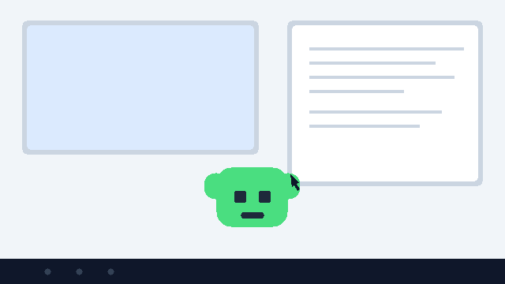

<div align="center">

<p>
  
</p>

# Mischief

### by [Moiz Solutions](https://tools.moiz.solutions)

[](CHANGELOG.md)
[](LICENSE)
[](https://github.com/moiz-za/Mischief)
[](https://github.com/moiz-za/Mischief/commits/main)
[](https://github.com/moiz-za/Mischief)
[](https://github.com/moiz-za/Mischief/releases)
[](https://github.com/moiz-za/Mischief/actions)
[](CONTRIBUTING.md)
[](#-installation)
[](.gitleaks.toml)

**The open-source platform for desktop entertainment.**

**Real personality for your computer.** Harmless desktop creatures, playful window antics, cursor surprises, and ambient companions — all optional, all reversible, all yours.

**100% offline & privacy-first.** No accounts. No telemetry. No analytics. Runs entirely on your machine.

---

</div>

## 📖 Table of Contents

- [Features](#-features)
- [Quick Demo](#-quick-demo)
- [How It Works](#-how-it-works)
- [Why Mischief](#-why-mischief)
- [Installation](#-installation)
- [Building Experiences](#-building-experiences)
- [Security & Privacy](#-security--privacy)
- [Repository Structure](#-repository-structure)
- [FAQ](#-faq)
- [Changelog](#-changelog)
- [Community & Support](#-community--support)
- [Author & Maintainer](#-author--maintainer)
- [License & Disclaimer](#-license--disclaimer)

---

## 🚀 Features

### 🎭 A platform, not an app

- **Experience Packs** — declarative, data-only content anyone can create: characters, antics, ambience, seasonal effects
- **Plugin SDK** — sandboxed extension host for real logic without touching core

### ⚖️ Deterministic personality engine

- Events carry **priority, conditions, and cooldowns** — the companion never spams you
- **Intensity levels** from _Silent_ to _Chaos_ — you decide how much mischief you want

### 🛡️ Safe by design

- Every effect is **reversible, optional, and transparent**
- Manifests validated at load — a strict security boundary before any third-party content runs
- Mischief is a mischievous friend — **never malware, never destructive**

### 🔒 Privacy-first & offline-first

- **No accounts, no telemetry, no analytics** — zero network calls by default
- Works entirely offline on Windows, macOS, and Linux

### 🧩 Built for contributors

- Pure, tested domain layer (`src/domain/`) with Vitest coverage
- CI that typechecks, lints, builds, tests, audits dependencies, and scans for secrets
- [`good first issue`](https://github.com/moiz-za/Mischief/issues?q=is%3Aissue+is%3Aopen+label%3A%22good+first+issue%22) bugs you can pick up in minutes

---

## 🖥️ Quick Demo

A Mischief companion wandering a desktop, bobbing as it goes:

<p align="center">
  
</p>

---

## ⚙️ How It Works

Mischief is a lightweight **Runtime** that loads modular **Experience Packs**. Packs are data — the runtime decides _when_ and _how_ to show them.

```
  1. LOAD ────► Experience Pack manifest validated (pure, tested domain layer)
                    │ PASS
                    ▼
  2. SCHEDULE ─► events scored by priority, conditions & cooldowns
                    │ event fires
                    ▼
  3. ACT ─────► overlay companion · window antics · cursor effects · audio
                    │
  4. REVERT ───► every effect is reversible
                    │ intensity: Silent → Chaos
```

Each step checks the previous before proceeding. Third-party content is never trusted blindly — validation happens before anything is scheduled or rendered.

---

## 🏆 Why Mischief

| Dimension          | Typical prank apps     | Desktop pets (Shimeji, Goose) | **Mischief**                                    |
| :----------------- | :--------------------- | :---------------------------- | :---------------------------------------------- |
| **Business model** | Ads, bundles, paywalls | Free, often abandoned         | **Open source, MIT**                            |
| **Safety**         | Irreversible effects   | Varies                        | **Reversible + transparent + intensity levels** |
| **Extensibility**  | Closed                 | Limited                       | **Experience Packs + plugin SDK**               |
| **Privacy**        | Telemetry              | Varies                        | **Zero telemetry, offline-first**               |
| **Platform**       | Single OS              | One OS                        | **Windows / macOS / Linux**                     |
| **Trust**          | Unknown binaries       | Unsigned                      | **CI-tested, gitleaks-scanned, reproducible**   |

---

## 🔧 Installation

### Option 1: Install a release (recommended)

Installers for Windows, macOS, and Linux are published in [Releases](https://github.com/moiz-za/Mischief/releases). Download the build for your OS, install, and a small companion appears at the corner of your desktop with a tray icon.

### Option 2: Run from source

> Requires Node.js 18+

```bash
git clone https://github.com/moiz-za/Mischief.git
cd Mischief
npm install
npm run dev
```

A small companion appears on your desktop, and a tray icon keeps Mischief running.

### Build installers locally

```bash
npm run dist:mac   # or dist:win / dist:linux
```

---

## 🧩 Building Experiences

Any data-only pack can become an experience. Start from the reference pack:

```bash
examples/experiences/sample-creature/   # a complete working character
examples/plugins/hello-plugin/          # a minimal plugin skeleton
```

- [Experience Pack docs](docs/experiences/README.md)
- [Plugin SDK docs](docs/sdk/README.md)
- [Community spec drafts](specs/README.md)

New to the project? Browse the [`good first issue`](https://github.com/moiz-za/Mischief/issues?q=is%3Aissue+is%3Aopen+label%3A%22good+first+issue%22) list — icons, localization, and manifest validation are great starting points.

---

## 🔒 Security & Privacy

Security is a core design principle, not an afterthought:

- **Secret scanning** — gitleaks blocks secrets in the pre-commit hook and in CI; the full history is scanned
- **Dependency audit** — `npm audit` runs in CI on every push
- **Pinned, maintained Electron** — upgraded and kept current
- **Zero telemetry** — Mischief makes no network calls by default; nothing leaves your machine
- **Private vulnerability reporting** — report via the repository's Security tab (see [`SECURITY.md`](SECURITY.md))

---

## 📦 Repository Structure

```
mischief/
├── src/                    Electron runtime
│   ├── main.ts             tray + overlay host
│   ├── preload.ts          secure IPC bridge
│   ├── renderer/           overlay companion
│   └── domain/             pure, tested logic (no Electron)
├── examples/               starter content
│   ├── experiences/sample-creature/
│   └── plugins/hello-plugin/
├── docs/                   api · architecture · development · sdk · user-guide
├── packs/                  installable Experience Packs
├── plugins/                installable plugins
├── tests/                  unit tests (Vitest)
├── benchmarks/
├── specs/                  community spec drafts
├── localization/           locale data
├── licenses/               third-party license texts
├── third_party/            vendored dependencies
├── tools/                  developer tooling
├── assets/                 branding + demo media
└── scripts/                build + hook tooling
```

---

## ❓ FAQ

**Q: Is Mischief malware?**
A: No. Every effect is reversible, optional, and transparent. It is a mischievous friend, never destructive.

**Q: Will it interfere with my work?**
A: You control the intensity — from _Silent_ to _Chaos_. Events respect priority, conditions, and cooldowns, so the companion never spams you.

**Q: Does it need an account or internet?**
A: No accounts, no telemetry, no analytics. It runs entirely offline.

**Q: Can I make my own companion?**
A: Yes. Experience Packs are declarative data — copy `sample-creature`, tweak the manifest and assets, and load it. No core changes needed.

**Q: What platforms are supported?**
A: Windows, macOS, and Linux. Builds are produced with electron-builder.

**Q: How is this different from Shimeji or Desktop Goose?**
A: They're single-app pets. Mischief is a **platform**: a small runtime that loads any number of packs, with safety, intensity controls, and an SDK at its core.

---

## 📋 Changelog

| Version    | Date    | Summary                                                                                                                                                                                   |
| ---------- | ------- | ----------------------------------------------------------------------------------------------------------------------------------------------------------------------------------------- |
| **v0.1.0** | 2026-08 | Initial foundation — Electron + TypeScript skeleton, overlay companion + tray, pure tested domain layer, CI (typecheck/lint/build/test/audit), gitleaks secret scanning, packaging config |

See full [CHANGELOG.md](./CHANGELOG.md) for details.

---

## 🤝 Community & Support

- **Report bugs & request features** — [Open a GitHub Issue](https://github.com/moiz-za/Mischief/issues)
- **Questions** — GitHub Discussions on this repository
- **Contribute** — See [CONTRIBUTING.md](./CONTRIBUTING.md) for guidelines; every PR is squashed and CI-gated
- **Star the repo** — Helps others discover Mischief

---

## 👤 Author & Maintainer

Built and maintained by **Moiz Zoaib Ali**:

- **Personal Website:** [moiz.solutions](https://moiz.solutions)
- **AI Tools Directory:** [tools.moiz.solutions](https://tools.moiz.solutions)
- **GitHub Profile:** [@moiz-za](https://github.com/moiz-za)

---

## 📄 License & Disclaimer

- **License:** Distributed under the **MIT License**. Copyright (c) 2026 Moiz Zoaib Ali. See [`LICENSE`](./LICENSE) for details.
- **Disclaimer:** Mischief is provided for entertainment. All effects are reversible and user-controlled; the user remains responsible for how the software is used. Not affiliated with or endorsed by any OS vendor.

---

<div align="center">

**Built by [Moiz Solutions](https://tools.moiz.solutions)** · Report issues on [GitHub](https://github.com/moiz-za/Mischief/issues)

</div>
